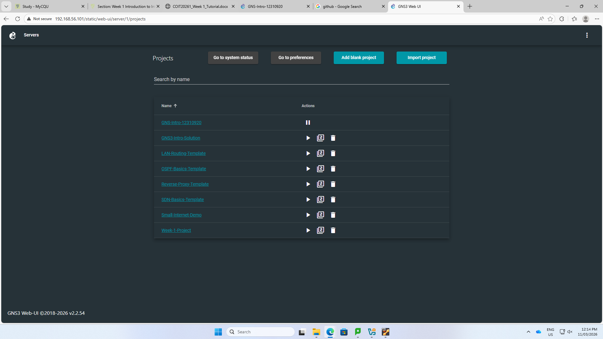
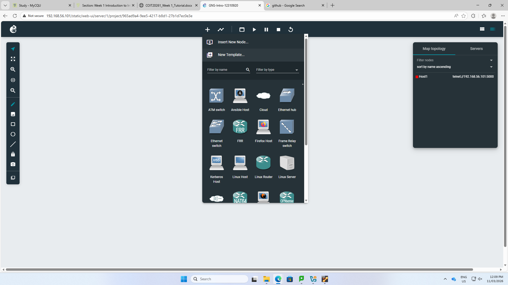
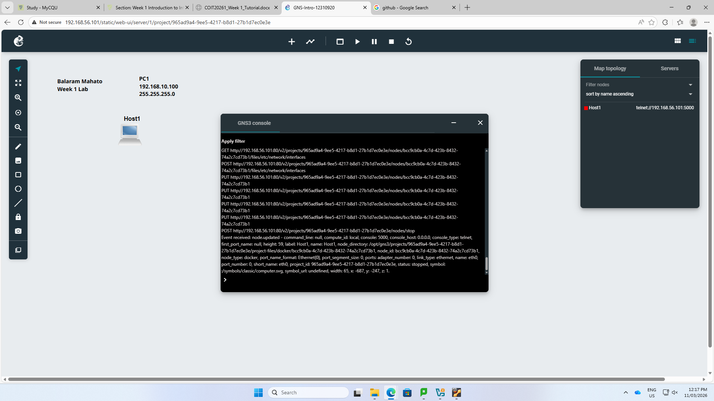
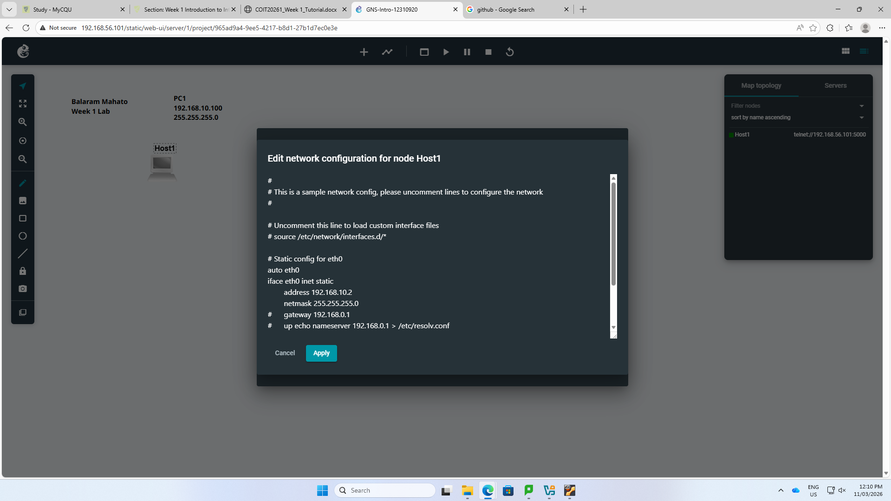
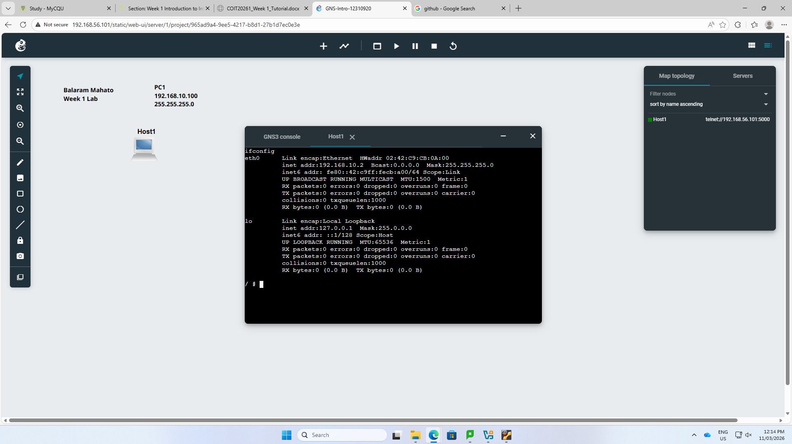
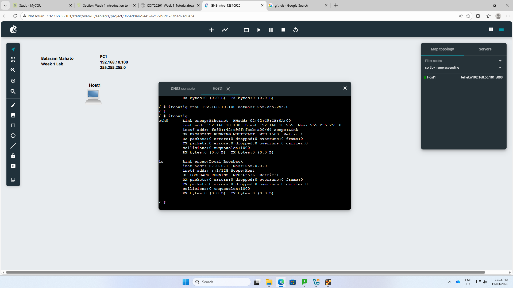

Week 01 Portfolio
- Student Details
- Name: Balaram Mahato
- Student ID: 12310920

Task 1: Introduction to GNS3 Basics
Aim
- This week I have learned about basic of GNS3. To create a project, add a Linux host, configure the IP address, use the web console, and verify the IP address.

Software Used
- Oracle VirtualBox
- GNS3 Web UI
- GitHub

Activities Completed
 1. Created a new project named GNS3-Intro-12310920.
  
 2. Added a new Linux host.
  
 4. Added text showing name and IP address.
  
 6. Selected an IP address for the host and configured the node to use a static IP address.
  
 9. Started the node.
  
 11. Opened a web console.
  
     

