Week2 Portfolio

Task 1: Setting Static IP Addresses

Aim
Three different approaches to setting a static IP address on a Linux host.

Activities Completed
 1. Created a new GNS3 project named Setting-IP-12310920.
     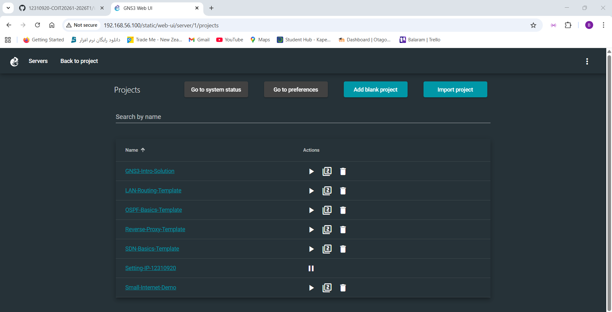
 2. Add four nodes of type Linux Host and one Ethernet switch, and connect together into a LAN.
     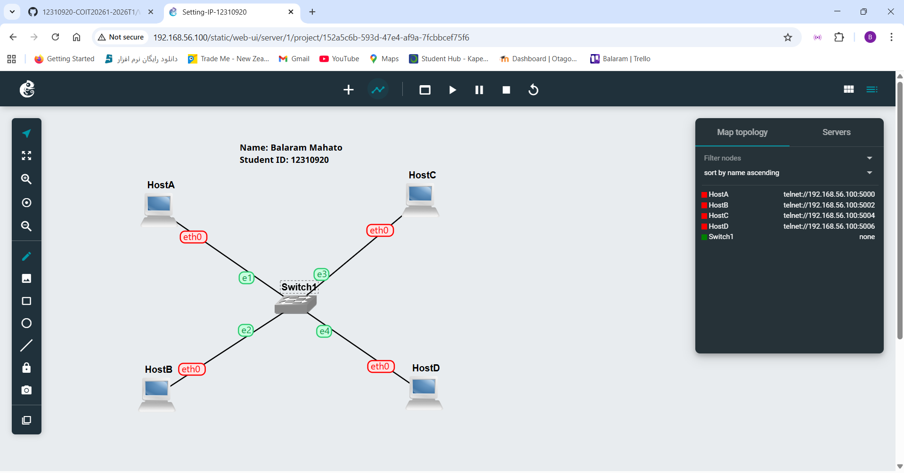                                                                                       
 4. Selected an IPv4 network address (192.168.10.0/24) to use in LAN.
    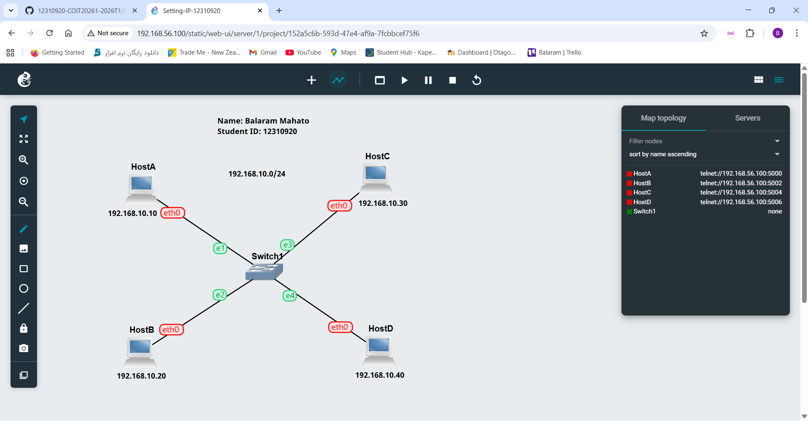
    
 5. For two of the hosts, I use the GNS3 Configure menu item to set static IP addresses on the nodes.
    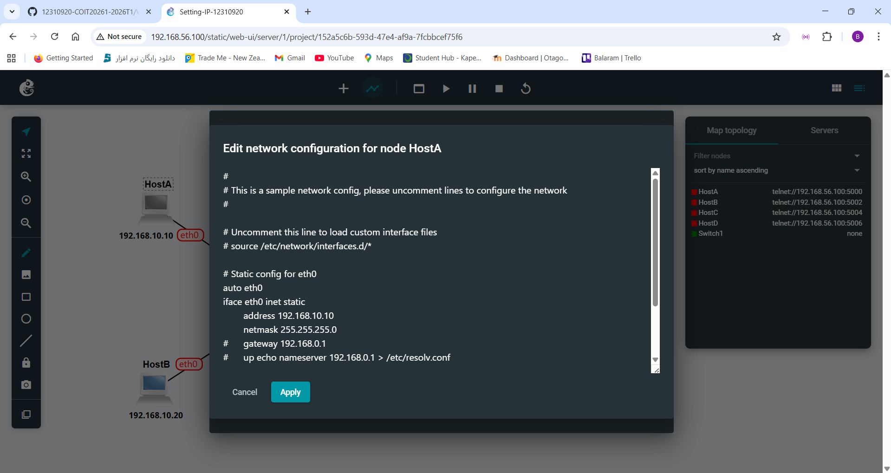
    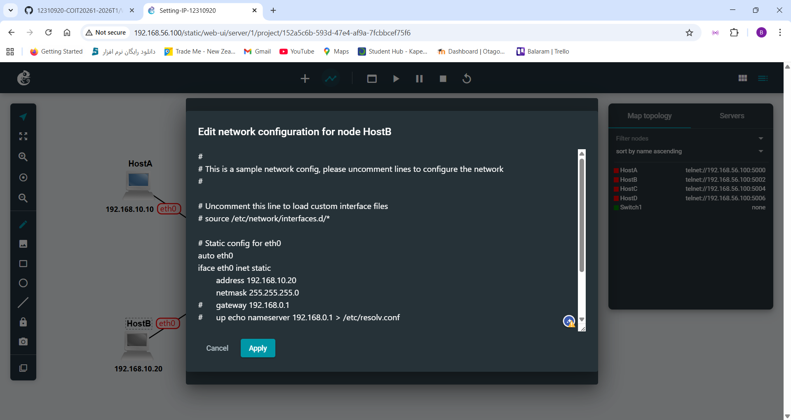
    
 7. Start all nodes.
    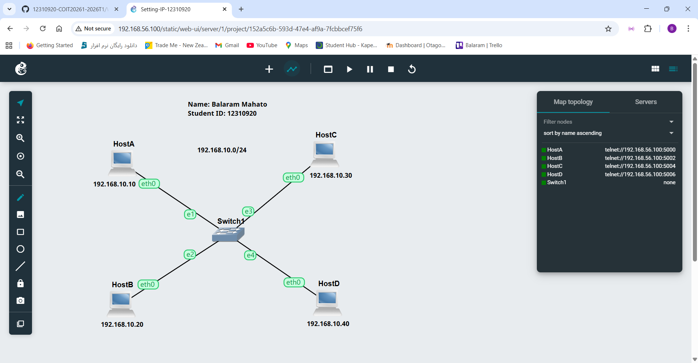
    
 11. On the 3rd and 4th hosts, opened a console and used the ip address add command to set a static IP address.
    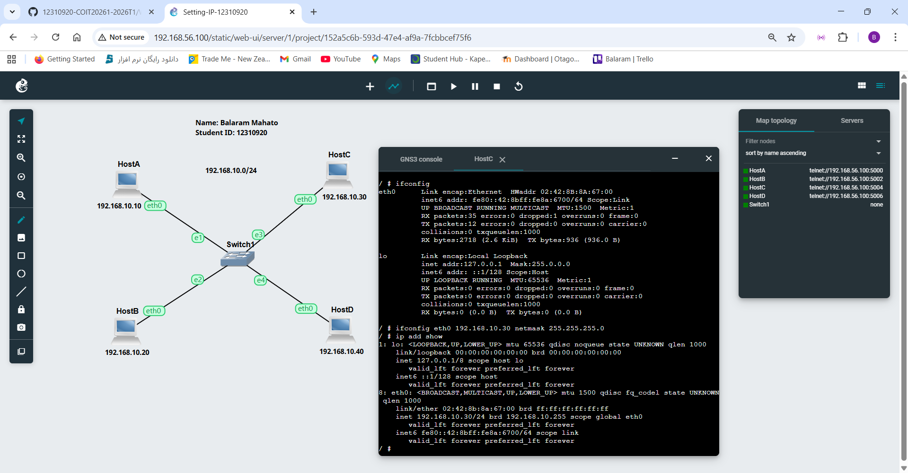
    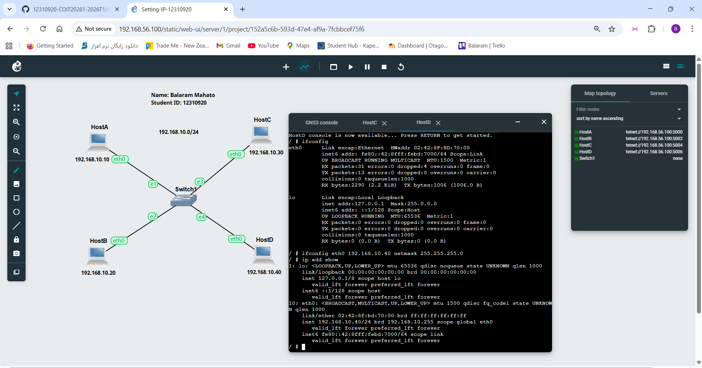

 13. Used the IP address show command to view and check the IP addresses of all four hosts.
    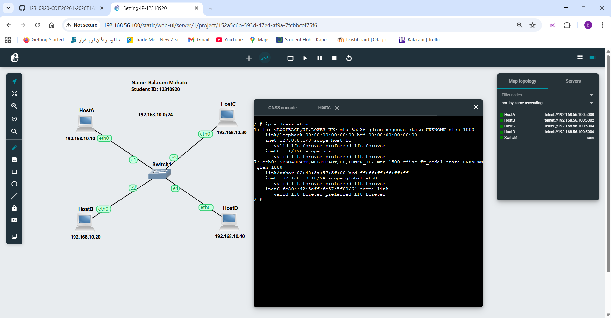
    
    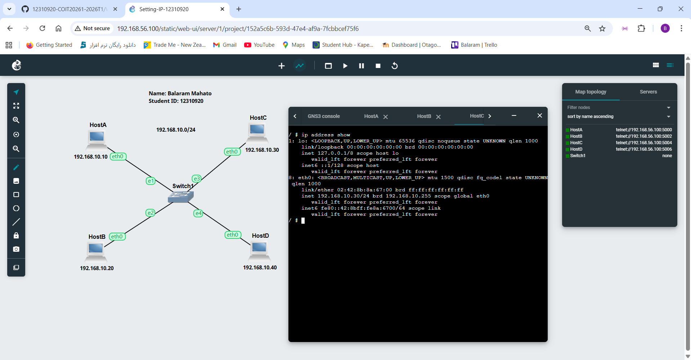
    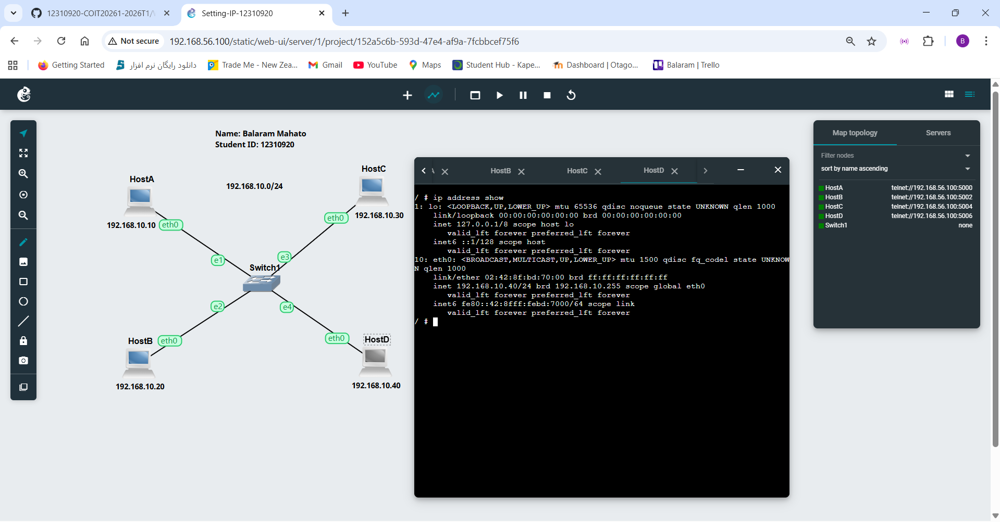

Task 2: Testing Network Connectivity and Delay with Ping
1.  Ping from host A to host B and stop the ping after at least five (5) response messages are received.
    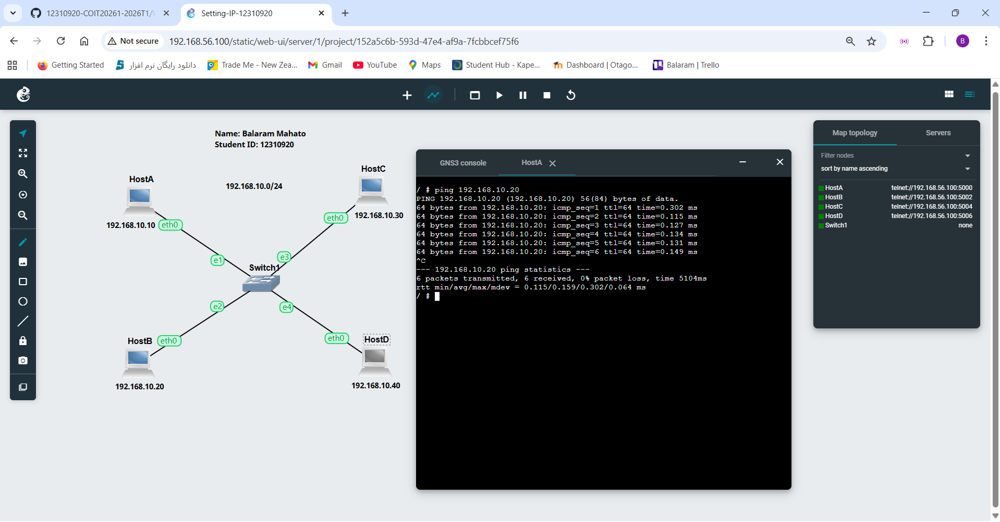
    
2.	Ping from the host A to an IP address that does not exist in my network and  wait at least 10 seconds before stopping the ping.
   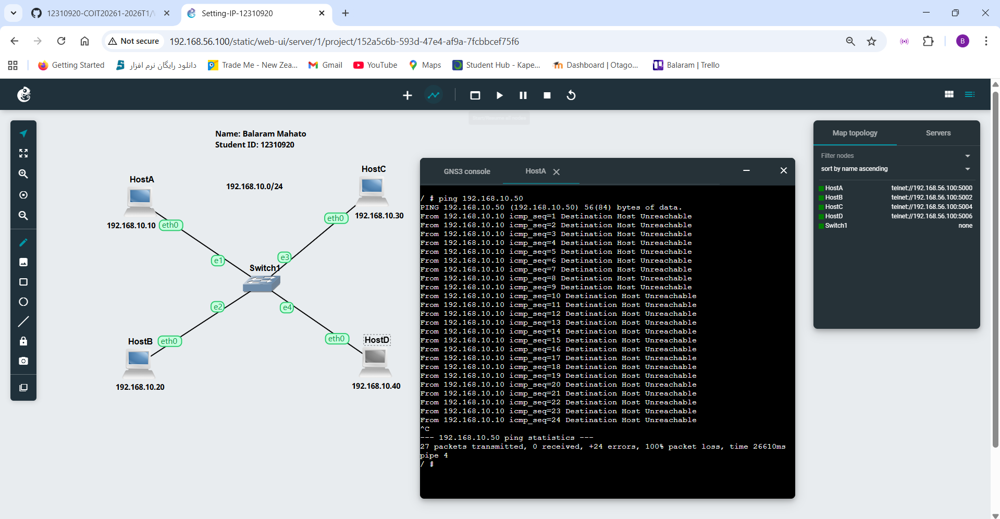
  	
3. Ping from the host C to host B by changing the count.
   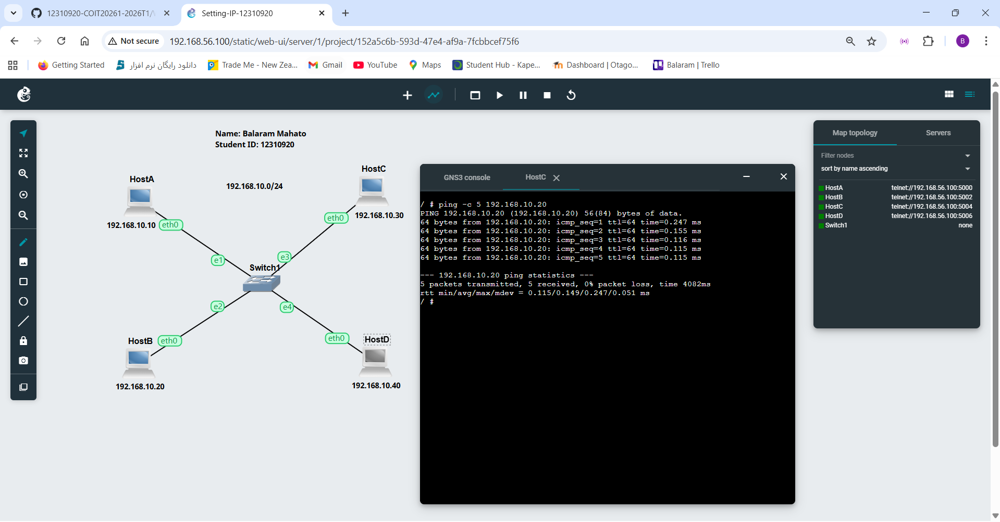
   
4. Ping from the host C to host B by changing the interval.
   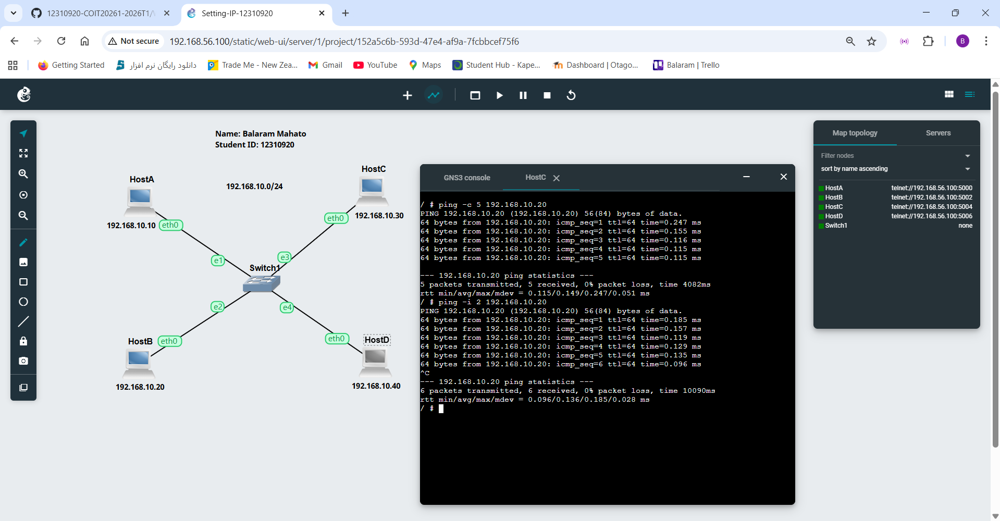

5. Ping from the host C to host B by changing the size.
   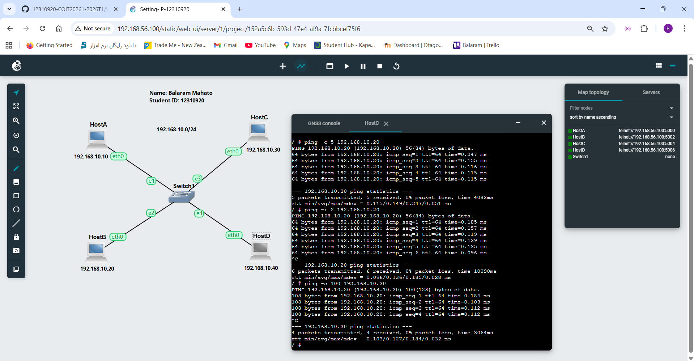

6. Ping from the host C to host B by combined options.
   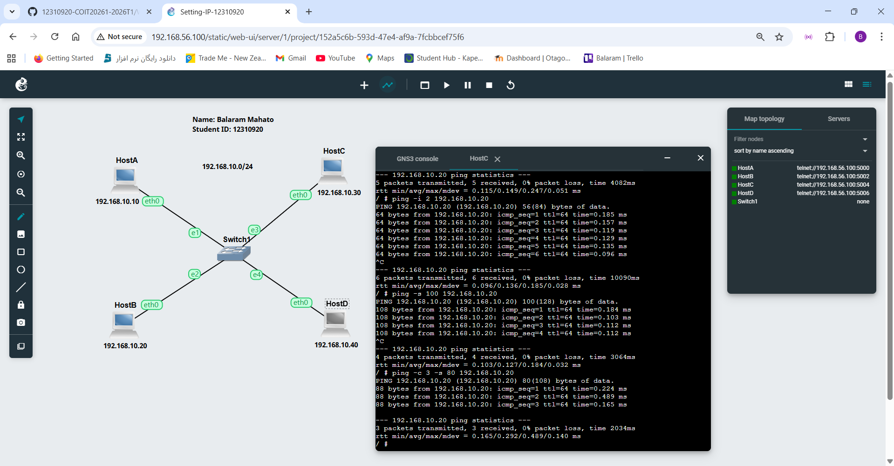
