Week2 Portfolio
Task 1: View Routing Tables
Aim 
Learn how to view routing tables and enable forwarding on a router. 
Activities Completed
1.	Created a project named View-Routes-12310920.
    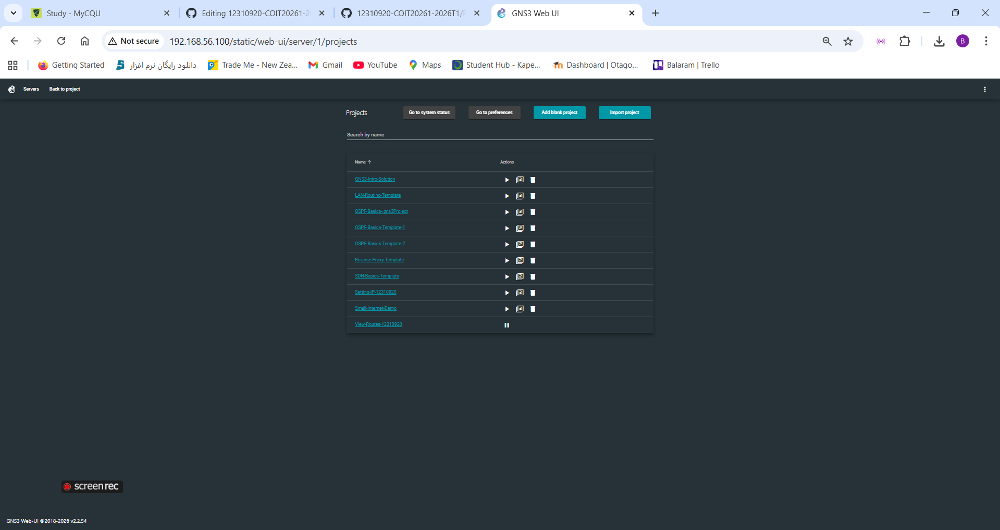

2.	Added two nodes of Linux host, one router, and one Ethernet switch.
    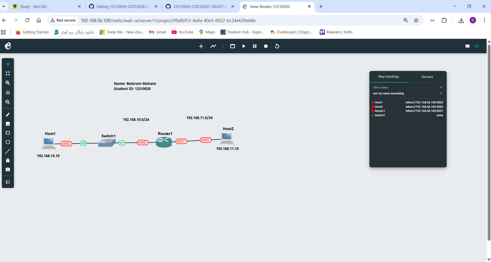
  	
3.	IP configuration of host1, host2, and router.
    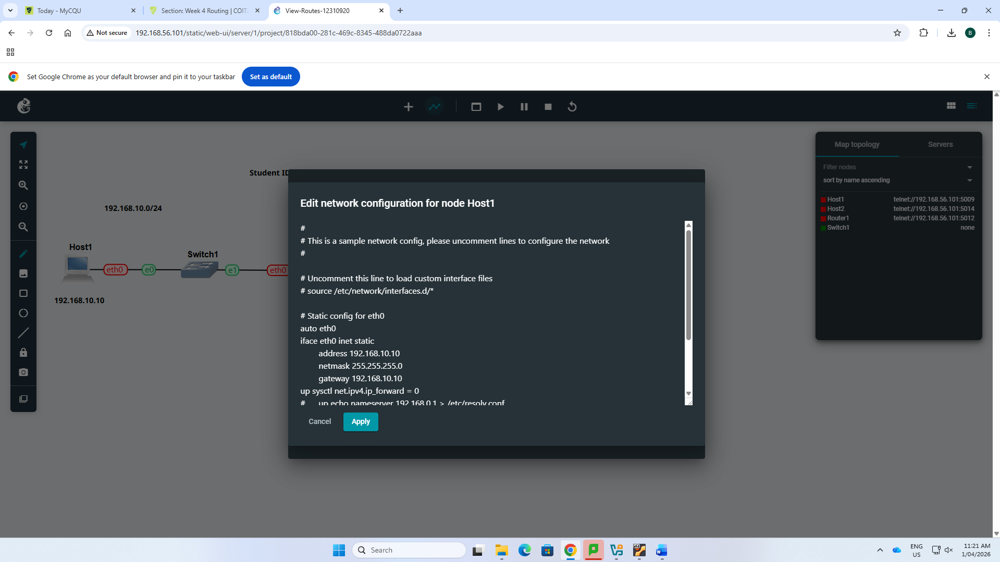
  	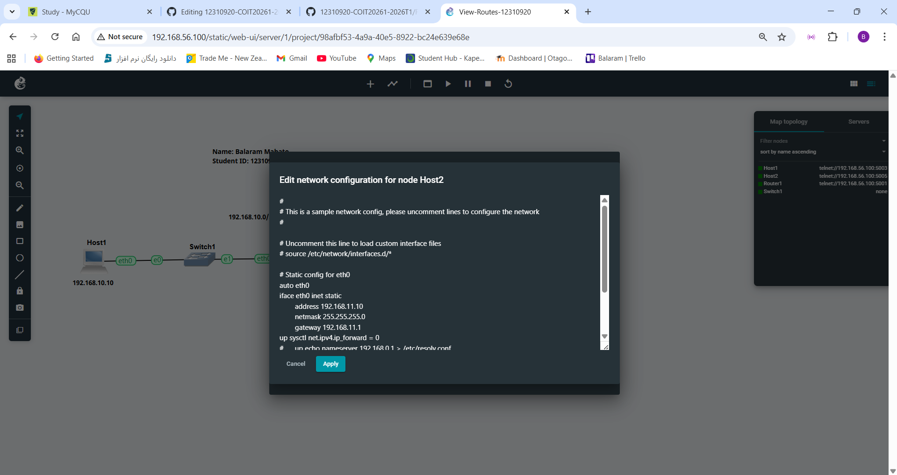
  	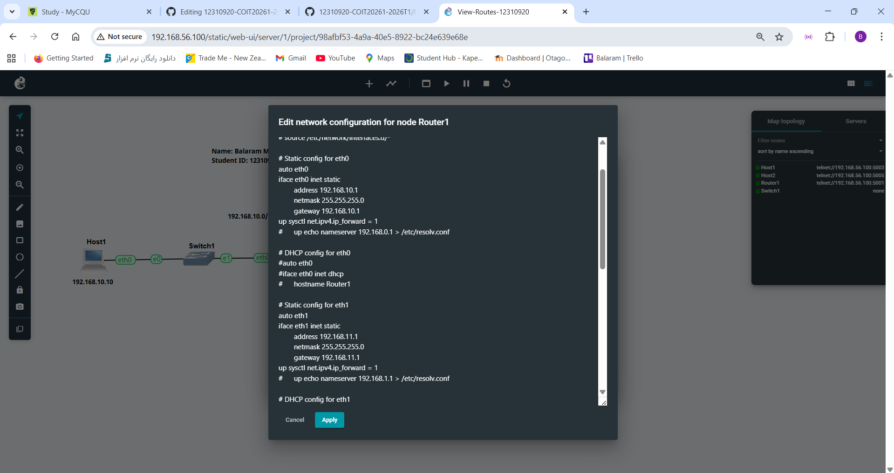
  	
4.	Routing table of the host and router.
    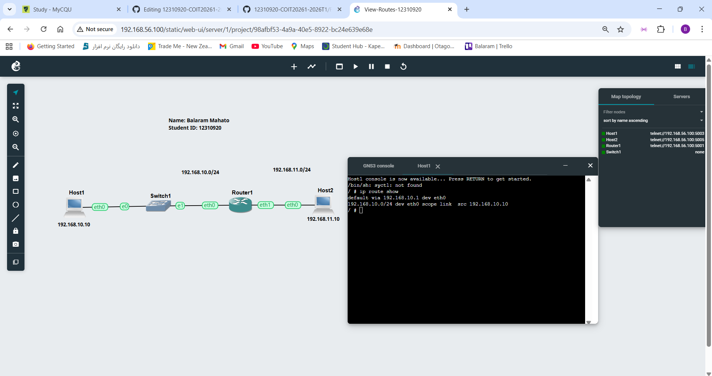
  	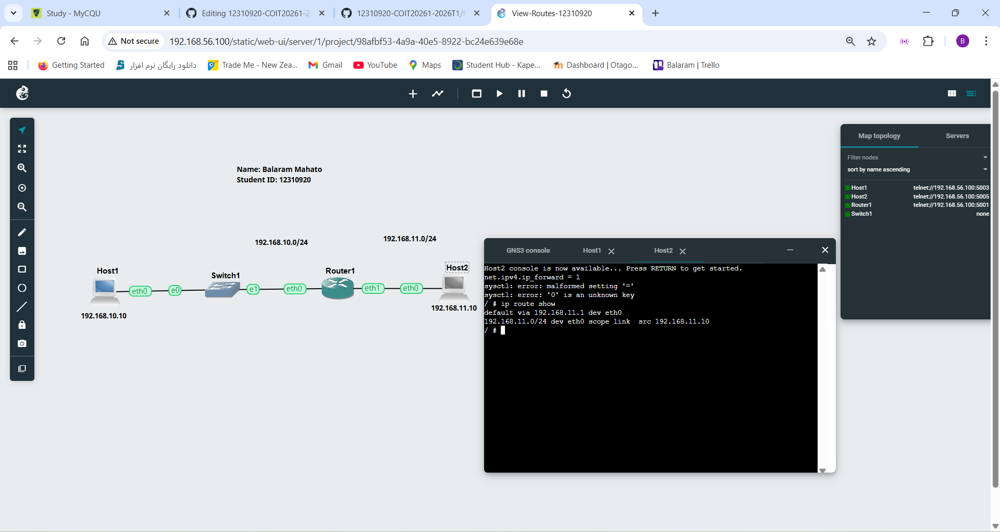
  	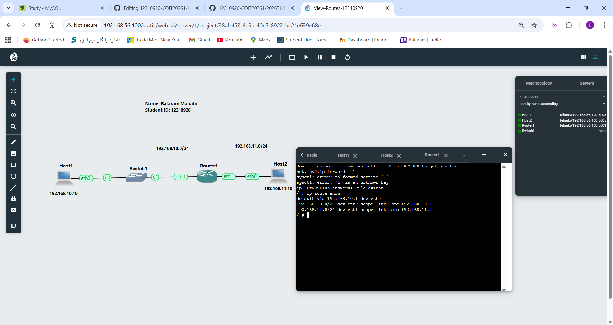
  	
5.	Successfully ping host1 to host2.
    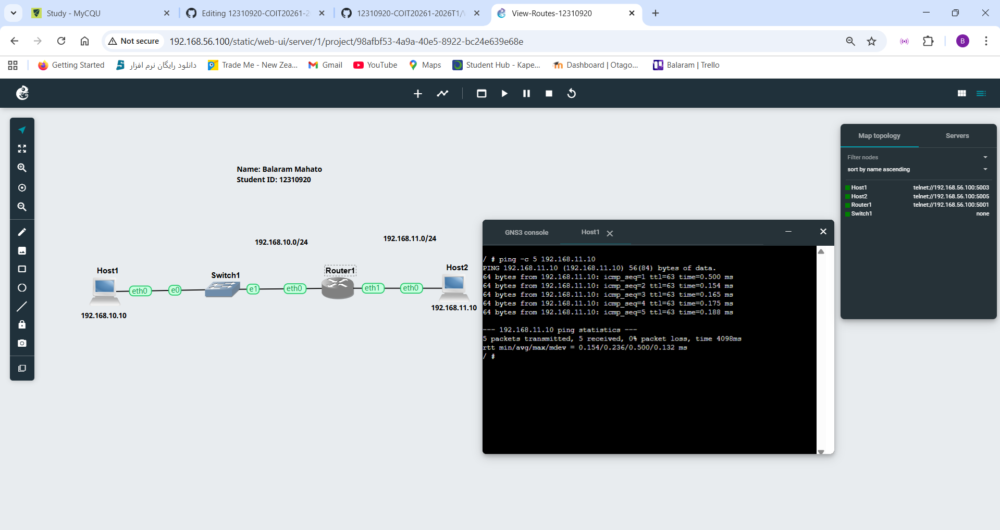

Task 2: Dynamic Routing with OSPF.
Aim 
Observe how dynamic routing is setup and handles network changes

Activities Completed
1. Duplicated OSPF-Basic-Template project.
    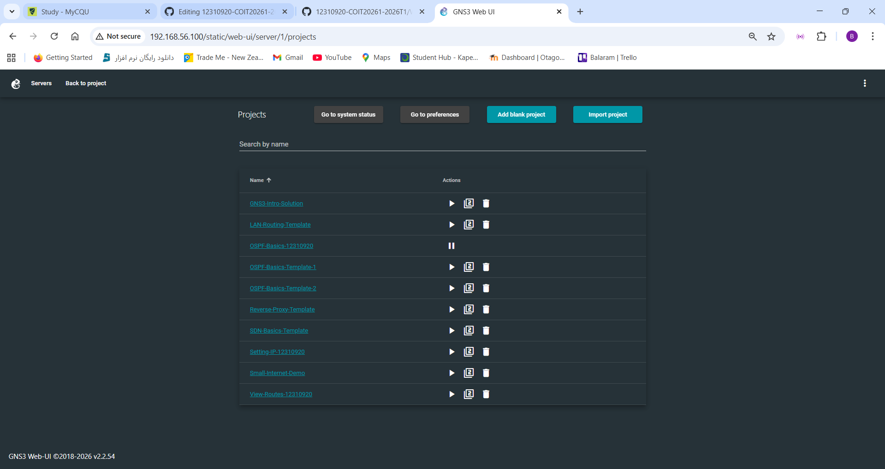
   
3. Created a Network Project.
    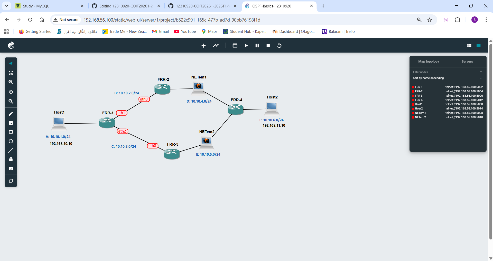
   
5. Output of neighbour routers of FRR1.
    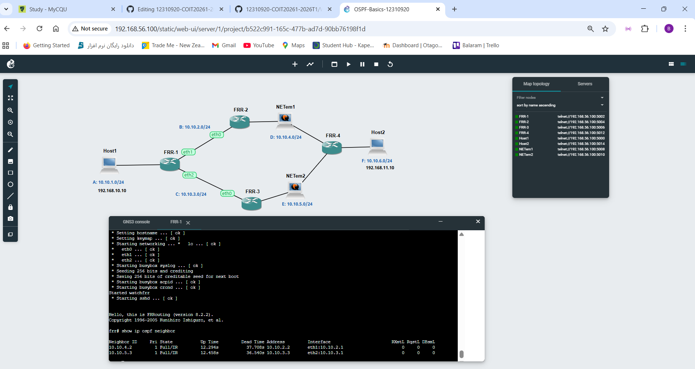
   
7. Output of the routing table for two routers.
    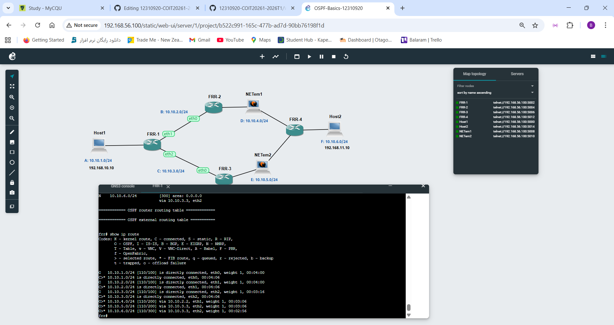
   
9. A table that summarises the routers for all routers.
    
   
11. Output of traceroute commands after the link is disconnected.
    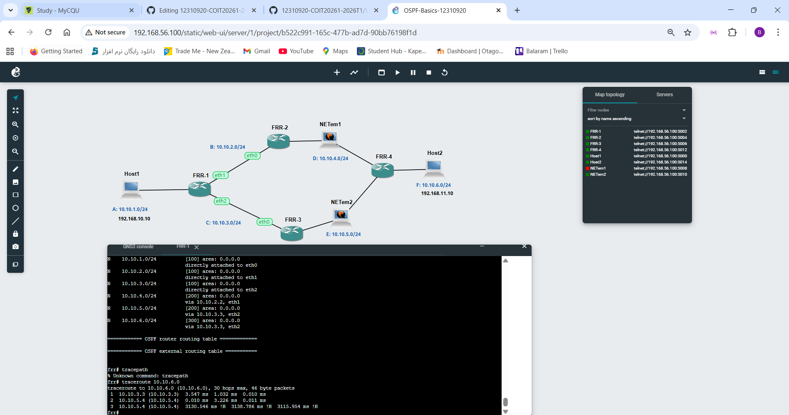
       

  
	

