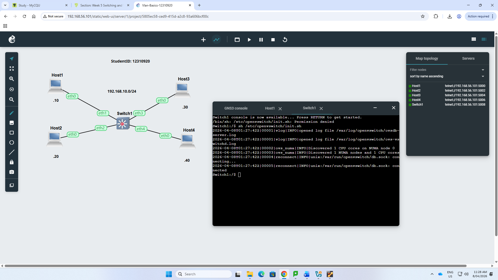
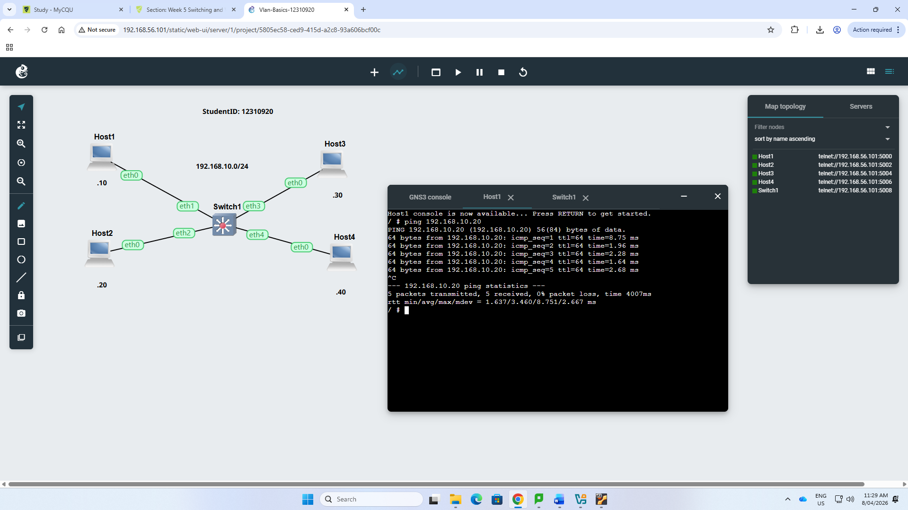
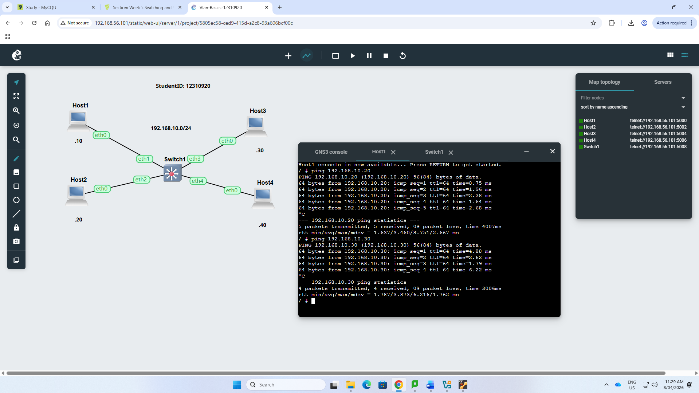
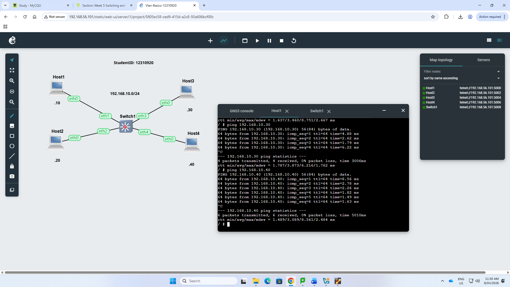
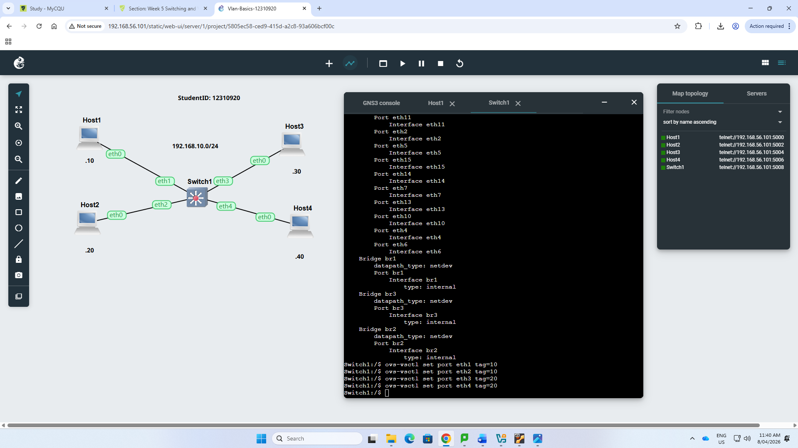
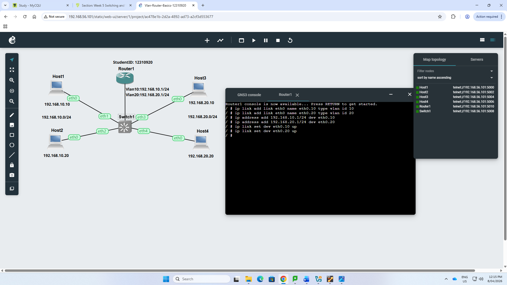
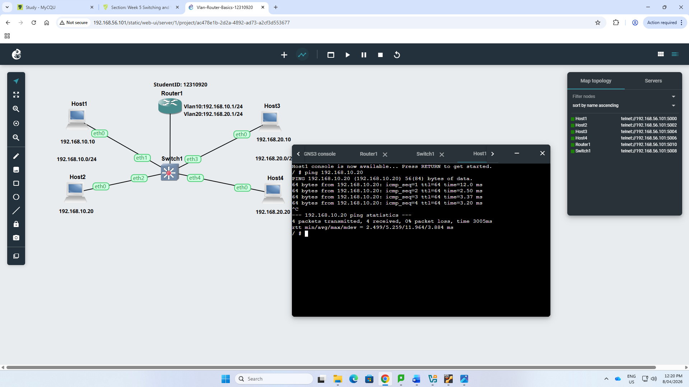
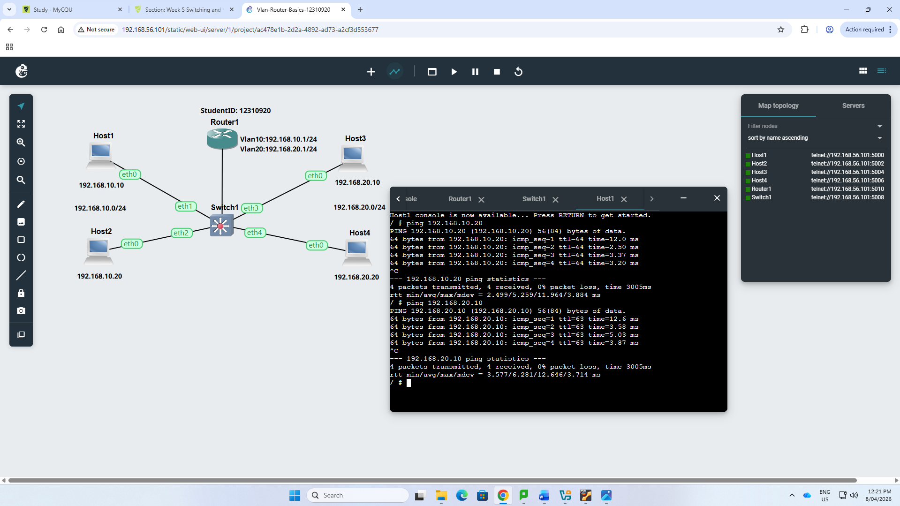
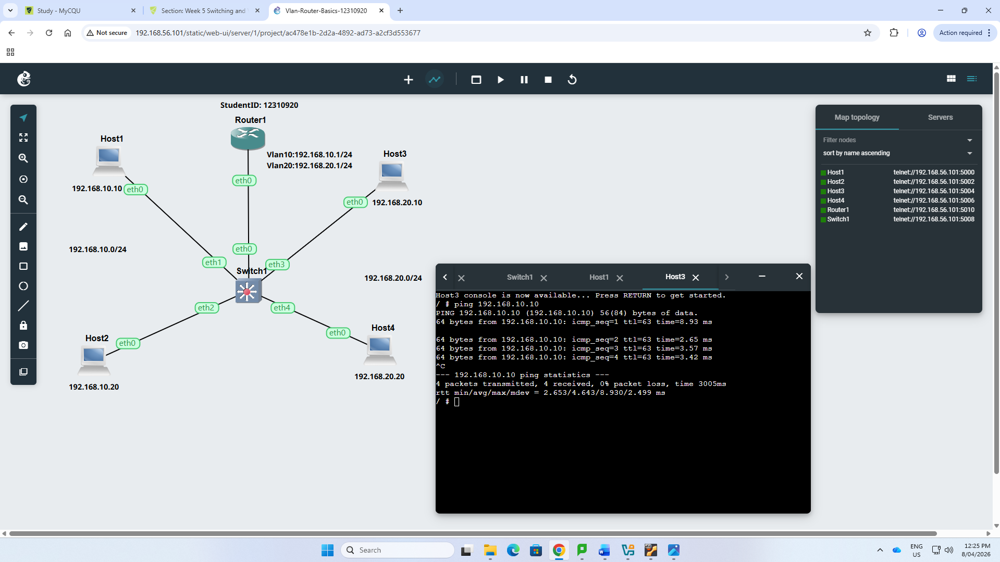
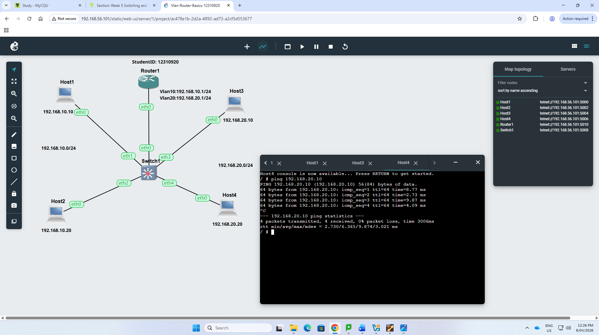

# Week 05 Portfolio
- Student Details
- Name: Balaram Mahato
- Student ID: 12310920

Task 1: Setup VLANs on the switch
Aim
- This task helped me to configure VLANs on an OpenvSwitch, connect multiple Linux hosts, test connectivity before VLAN separation, and assign switch ports to different VLANs.

Activities Completed
1. Created a new project named Vlan-Basics-12310920 and added four Linux Hosts and one OpenvSwitch.
   

2. Configured all four hosts in the same subnet 192.168.10.0/24 and started all nodes.
   

3. Tested connectivity from Host1 to Host2.
   

4. Tested connectivity from Host1 to Host3.
   

5. Tested connectivity from Host1 to Host4.
   

6. Viewed the switch port information and configured VLAN tagging on the OpenvSwitch. Ports eth1 and eth2 were assigned to VLAN 10, while ports eth3 and eth4 were assigned to VLAN 20.
   

Task 2: Setup VLANs on a Router
Aim
- This task helped me to connect a Linux Router to the switch, configure VLAN sub-interfaces, use a trunk link, and enable communication between two different VLANs.

Activities Completed
1. Created a new project named Vlan-Router-12310920 by extending the VLAN Basics topology and adding one Linux Router connected to switch port eth0.
   

2. Configured Host1 and Host2 in subnet 192.168.10.0/24, and Host3 and Host4 in subnet 192.168.20.0/24.
   

3. Configured VLAN sub-interfaces on the router using eth0.10 and eth0.20, and assigned IP addresses 192.168.10.1/24 and 192.168.20.1/24.
   

4. Tested connectivity from Host1 to Host2 within VLAN 10.
   

5. Tested connectivity from Host1 to Host3 across VLANs through the router.
   

6. Tested connectivity from Host1 to Host4 across VLANs through the router.
   

7. Tested connectivity from Host3 to Host1 through the router.
   

8. Tested connectivity from Host4 to Host2 through the router.
   
