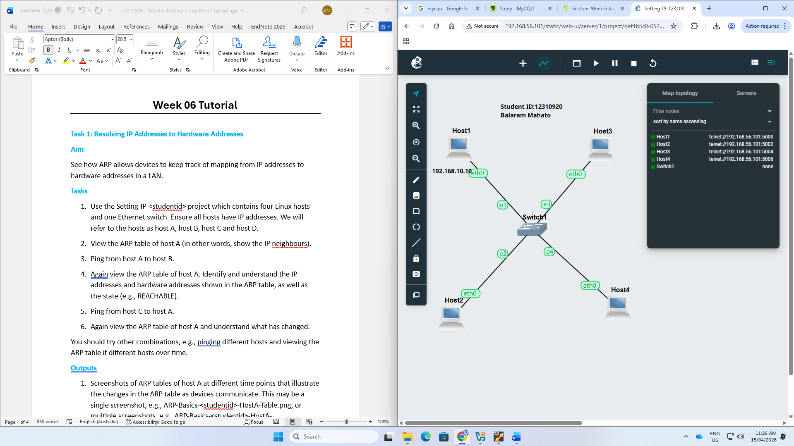
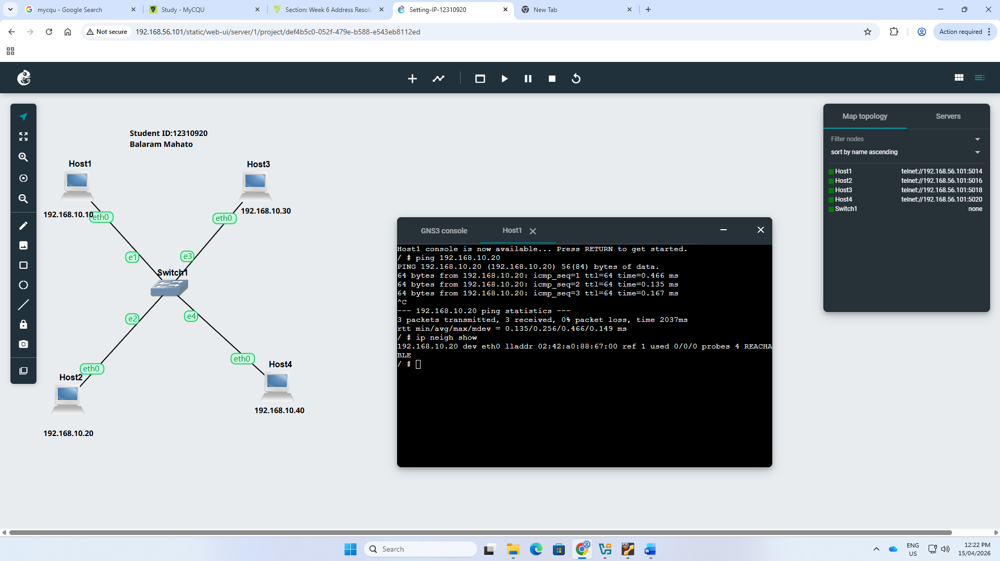
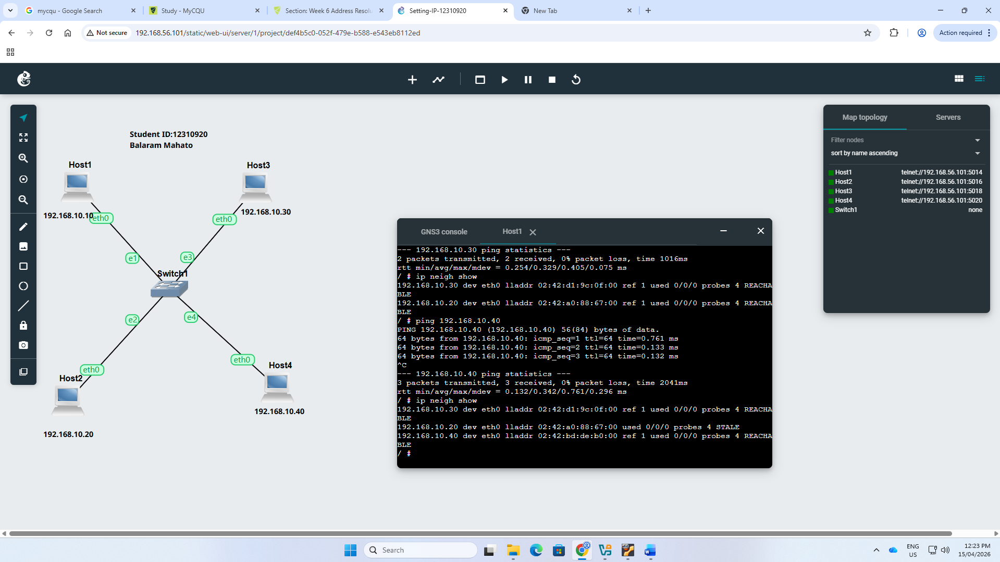
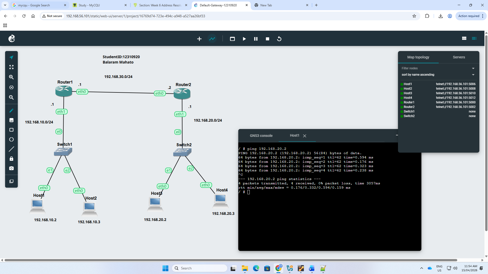
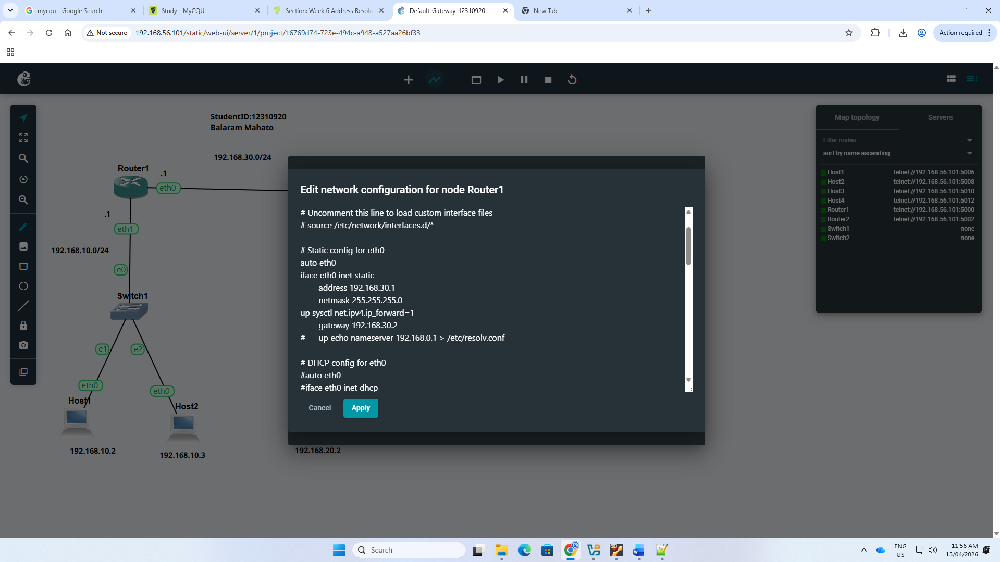
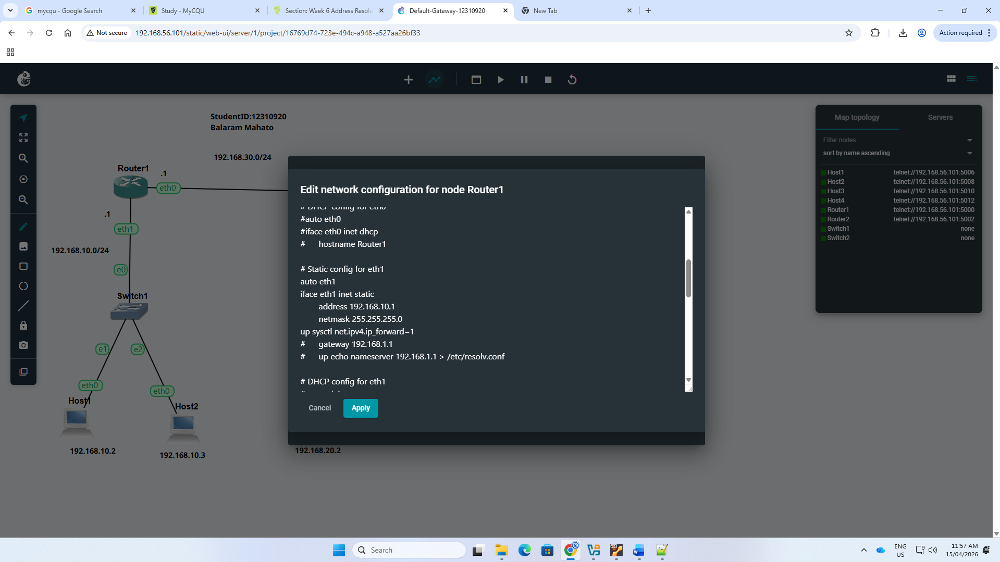
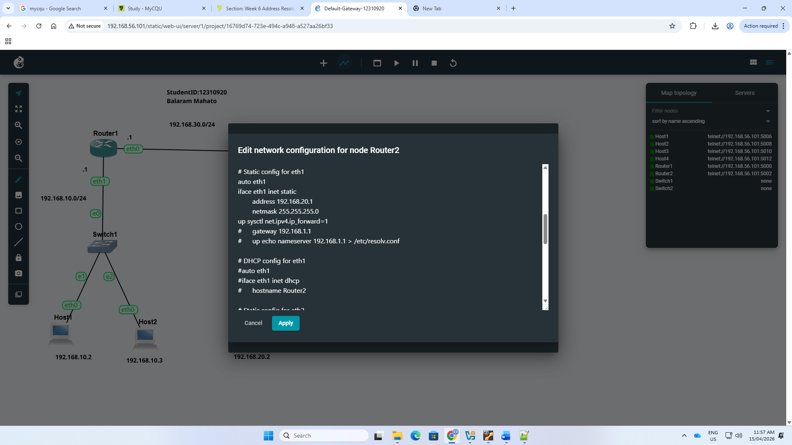
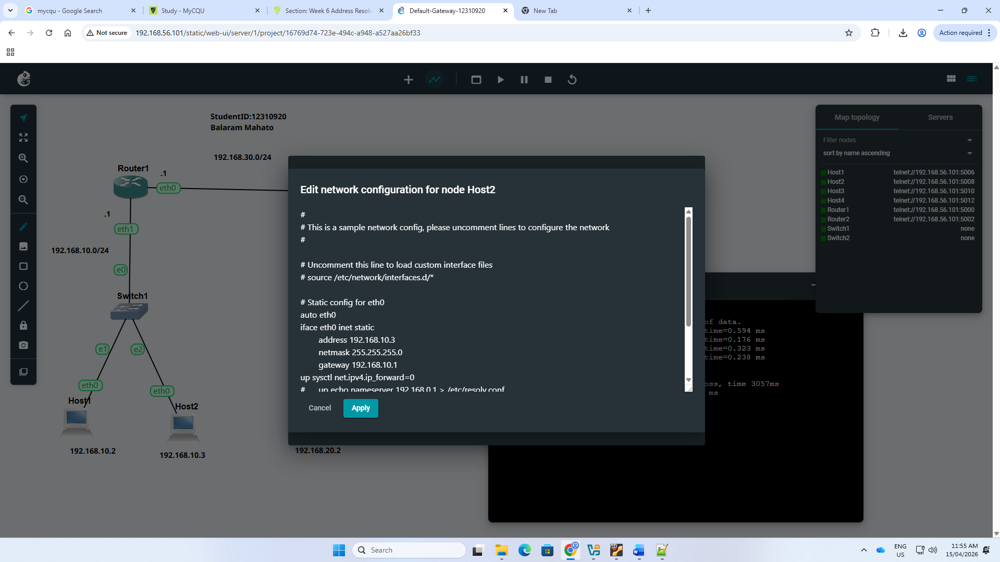
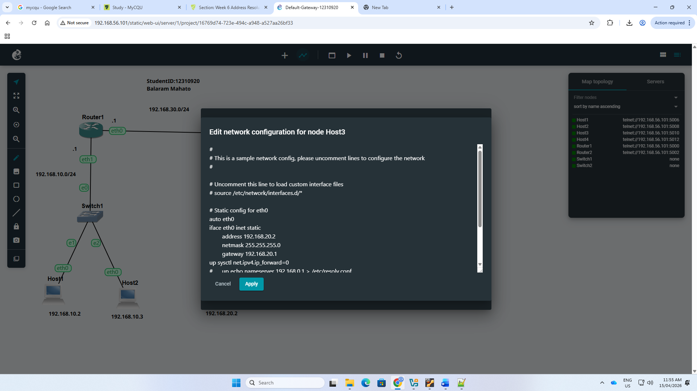
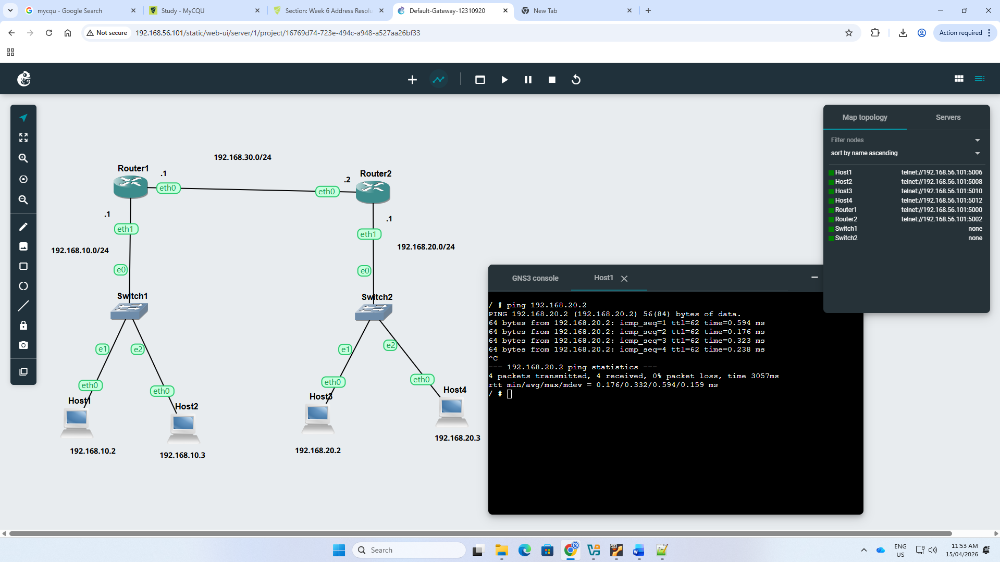

# Week 06 Portfolio
- Student Details
- Name: Balaram Mahato
- Student ID: 12310920

Task 1: Resolving IP Addresses to Hardware Addresses
Aim
- This task helped me to understand how ARP resolves IP addresses to hardware addresses and how the ARP table changes as hosts communicate on the same LAN.

Activities Completed
1. Used the existing Setting-IP-12310920 project containing four Linux hosts and one Ethernet switch. Ensured all hosts had IP addresses in subnet 192.168.10.0/24.
   

2. Pinged Host2 from Host1 and then viewed the ARP table of Host1.
   

3. Pinged Host3 from Host1 and again viewed the ARP table of Host1. A new ARP entry was added.
   

4. Pinged Host4 from Host1 and viewed the ARP table. The ARP table now showed multiple neighbour entries and different states.
   

Task 2: Default Gateways
Aim
- This task helped me to learn how default gateways enable communication between different subnets using Linux routers and static IP configuration.

Activities Completed
1. Created a new project named Default-Gateway-12310920 with four Linux hosts, two Linux routers, and two Ethernet switches across three subnets.
   

2. Configured Router1 with IP addresses on both interfaces and enabled forwarding.
   
   

3. Configured Router2 with IP addresses on both interfaces and enabled forwarding.
   
   

4. Configured all hosts with static IP addresses, correct default gateways, and disabled forwarding.
   
   
   
   

5. Recorded the IP addresses and routing information for all devices.

   IP Address Summary
   - Host1: 192.168.10.2/24, gateway 192.168.10.1
   - Host2: 192.168.10.3/24, gateway 192.168.10.1
   - Router1 eth1: 192.168.10.1/24
   - Router1 eth0: 192.168.30.1/24, gateway 192.168.30.2
   - Router2 eth0: 192.168.30.2/24, gateway 192.168.30.1
   - Router2 eth1: 192.168.20.1/24
   - Host3: 192.168.20.2/24, gateway 192.168.20.1
   - Host4: 192.168.20.3/24, gateway 192.168.20.1

   Routing Summary
   - Host1 and Host2 use subnet 192.168.10.0/24 directly and send other traffic to the default gateway 192.168.10.1
   - Host3 and Host4 use subnet 192.168.20.0/24 directly and send other traffic to the default gateway 192.168.20.1
   - Router1 connects subnet 192.168.10.0/24 to subnet 192.168.30.0/24
   - Router2 connects subnet 192.168.20.0/24 to subnet 192.168.30.0/24
   - Router1 uses Router2 as the next hop through 192.168.30.2
   - Router2 uses Router1 as the next hop through 192.168.30.1

6. Tested connectivity across subnets. Host1 successfully pinged Host3 on a different subnet through the routers.
   
